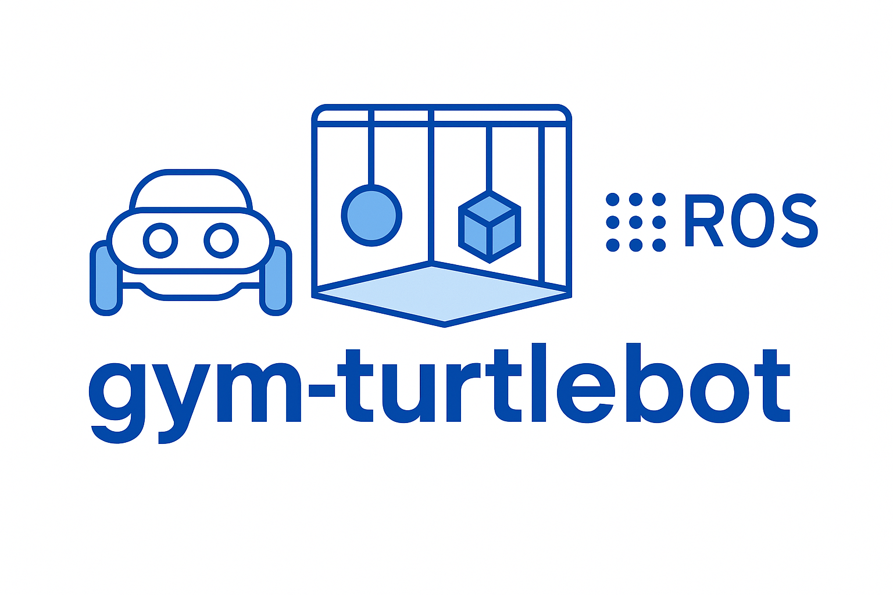

<p align="center">
  
</p>

<h1 align="center">gym-turtlebot</h1>

<p align="center">
  A custom Gymnasium environment for deep reinforcement learning (DRL) with TurtleBot4 in ROS 2 & Gazebo, featuring robust navigation and advanced planners.
</p>
<p align="center">
## Demonstration Video

```markdown
[
```

## Overview

`gym-turtlebot` provides a lightweight, modular environment for training reinforcement learning agents using a TurtleBot4 robot simulated in **ROS 2 Jazzy** and **Gazebo Harmonic**. It wraps the simulation in a standard [Gymnasium](https://gymnasium.farama.org/) interface to enable fast prototyping and evaluation of DRL algorithms in realistic robotics environments.

---

## What's New / Current Progress

- **Ultra-Conservative Navigation**: Integrated Model Predictive Path Integral (MPPI) controller and SMAC Hybrid planner for robust, kinematically-feasible, and safe navigation.
- **Advanced Obstacle Avoidance**: Tuned costmaps, critics, and inflation layers for rigorous obstacle avoidance; robot maintains wide safety margins.
- **Robust Localization**: AMCL enabled and tuned for reliable localization and minimal odometry drift.
- **Dynamic Goal Assignment**: Python script for sending random navigation goals, with logic to wait for goal completion.
- **Optimized for Realistic Environments**: All navigation parameters aligned for safe, smooth, and responsive operation in dynamic scenarios.
  <a href="https://github.com/anurye/gym-turtlebot/actions/workflows/ros.yaml">
  </a>
  <a href="https://docs.ros.org/en/jazzy/Installation.html">
    
  </a>
  <a href="https://gazebosim.org/docs/harmonic/ros_installation/">
    
  </a>
  <a href="https://www.python.org/downloads/">
    
  </a>
</p>

---

## Overview

`gym-turtlebot` provides a lightweight, modular environment for training reinforcement learning agents using a TurtleBot4 robot simulated in **ROS 2 Jazzy** and **Gazebo Harmonic**. It wraps the simulation in a standard [Gymnasium](https://gymnasium.farama.org/) interface to enable fast prototyping and evaluation of DRL algorithms in realistic robotics environment.

---


## Features

- ROS 2–based robot control integration
- Customizable Gazebo simulation worlds
- Gymnasium-compliant API
- Supports headless and visual simulation
- Easily extendable for custom robots
- **MPPI controller** for predictive, safe local planning
- **SMAC Hybrid planner** for smooth, kinematically-feasible global paths
- **Ultra-conservative costmap and critic settings** for safety
- **AMCL-based localization**
- **Random navigation goal script** (Python, waits for completion)

---

git clone https://github.com/anurye/gym-turtlebot.git

## Installation

### Using Docker
#### Prerequisites
- [Docker](https://docs.docker.com/engine/install/)
- [VSCode](https://code.visualstudio.com/) with [remote containers plugin](https://marketplace.visualstudio.com/items?itemName=ms-vscode-remote.remote-containers) installed.

> **Note:** The Docker setup is adapted from [vscode_ros2_workspace](https://github.com/athackst/vscode_ros2_workspace). See the [template repository](https://github.com/athackst/vscode_ros2_workspace) for more details on using VS Code and Docker for ROS.

#### Steps
1. **Clone the repository**
  ```bash
  mkdir -p ~/ros2_ws
  cd ~/ros2_ws
  git clone https://github.com/anurye/gym-turtlebot.git
  ```
2. **Install dependencies**
  ```bash
  cd ~/ros2_ws/gym-turtlebot
  ./setup.sh
  ```
3. **Build the workspace and source the setup script**
  ```bash
  ./build.sh
  source install/local_setup.bash
  ```
4. **Launch simulation**
  ```bash
  ros2 launch tb4_gz_sim simulation.launch.py
  ```
5. **Run deep reinforcement learning training example**
  > **Important:** Gazebo Sim does not support model reset at the moment. To work around this limitation, we reset both the robot's odometry and its pose by using:
  > 1. The `SetPose` service from the [robot localization](https://github.com/cra-ros-pkg/robot_localization) package to reinitialize odometry, and
  > 2. The `SetEntityPose` service from the [ros_gz_interfaces](https://github.com/gazebosim/ros_gz/tree/ros2/ros_gz_interfaces) package to reposition entities in Gazebo.
  ```bash
  python3 src/tb4_drl_navigation/tb4_drl_navigation/examples/sac.py train
  ```

### Local Setup
#### Prerequisites
- [Ubuntu 24.04](https://ubuntu.com/download/desktop)
- [ROS 2 Jazzy](https://docs.ros.org/en/jazzy/Installation.html)
- [Gazebo Harmonic](https://gazebosim.org/docs/harmonic/ros_installation/)

#### Steps
Follow the same steps as in the Docker section, but ensure all dependencies are installed natively on your system.

---


